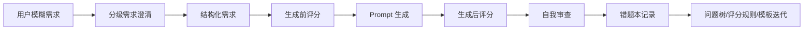

# 技术路线

## 总体路线图

## 需求澄清模块

`src/domain/question-tree.ts` 定义 Level 0 到 Level 4 的问题树。每个问题包含层级、场景、题目、回答类型、是否必答、是否阻塞、填充 prompt 字段和服务的评分维度。

## Prompt 评分模块

`src/domain/scoring-rubric.ts` 定义 8 个评分维度，总分 100。`src/core/prompt-scorer.ts` 使用字段证据、关键词证据、内容质量证据和反作弊惩罚计算维度得分，并输出扣分原因、缺失信息、anti-gaming warning、具体证据和 readiness level。

## 动态追问模块

`src/core/question-engine.ts` 提供 `getNextFollowUpQuestions`。系统根据场景、已回答内容和低分维度选择每轮最多 3 个追问，并说明追问原因、示例答案和影响维度。

## Prompt 生成模块

`src/core/prompt-generator.ts` 根据 `StructuredRequirement` 和目标工具配置生成最终 prompt。Codex 类 prompt 强调先读文件、最小修改、禁止无关重构、验证命令和诚实报告结果。

## 自我审查模块

`src/core/prompt-reviewer.ts` 对生成 prompt 再评分，识别低分维度并输出修订建议。

## 错题本模块

`src/core/lesson-engine.ts` 定义 `PromptMistake` 和 `MistakeSummary`，记录原始 prompt、生成 prompt、生成前后分数、低分维度、错误类型和更新建议。`src/storage/lesson-store.ts` 将错题落盘到 `data/prompt-mistakes.json`，并提供统计与迭代建议。

## 数据流

1. 原始文本进入 session。
2. 问题树收集关键字段。
3. 评分器评估原始 prompt 和结构化需求。
4. 生成器输出目标工具 prompt。
5. reviewer 再评分。
6. lesson engine 将低分点转为可复用记录。

## 未来扩展

- 将问题树配置外置为 JSON/YAML。
- 使用真实样本校准评分规则。
- 接入真实学生使用数据，统计常见缺失维度。
- 基于错题本自动推荐问题树和模板改动。
- 提供 CLI/MCP 接口，嵌入 coding agent 工作流。
